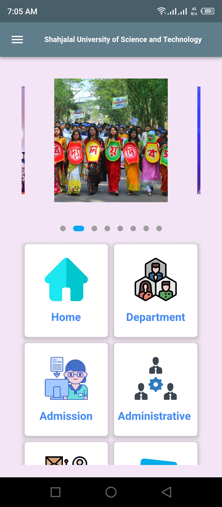
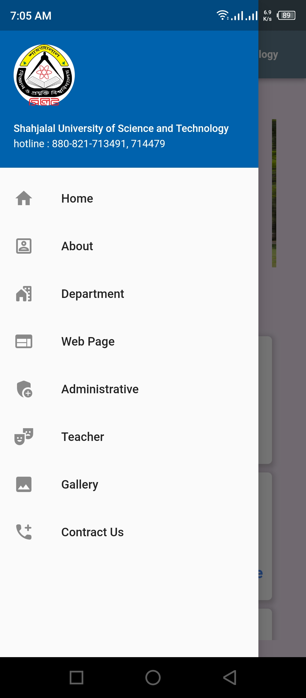
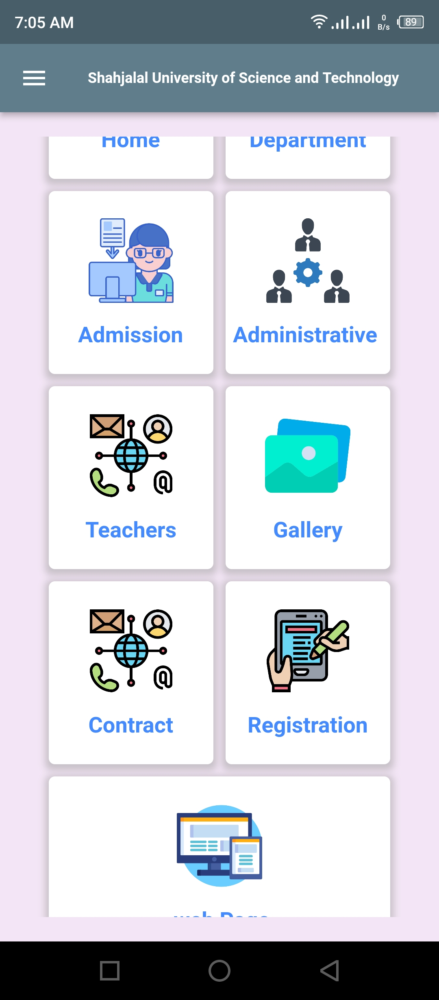
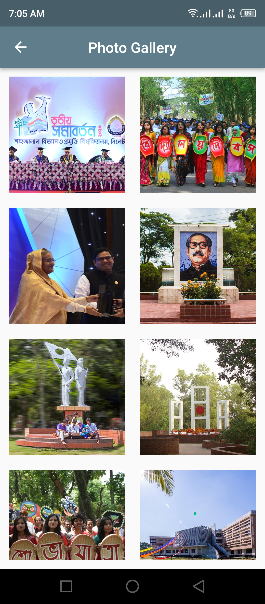

# sust

Collection of Shahjalal University of Science and Technologyl websites, resources

## Features

 - Clean & Modern User Interface
 - one click delivery services
 - university information notice
 - general information

## Screenshots

## Try SUST ?

Android: [Download sust.apk](https://github.com/codereyamin/sust/raw/main/apk/app-release.apk)

## Developer

Hi there! I am Tuhin Ikbal Eyamin. I create Android apps for solving problems and to make things easier. Try out my new app sust. If you have any query related to it don't hasitate to [e-mail me](mailto:codereyamin@gmail.com). And also check out my other stuffs [here](https://github.com/codereyamin).

